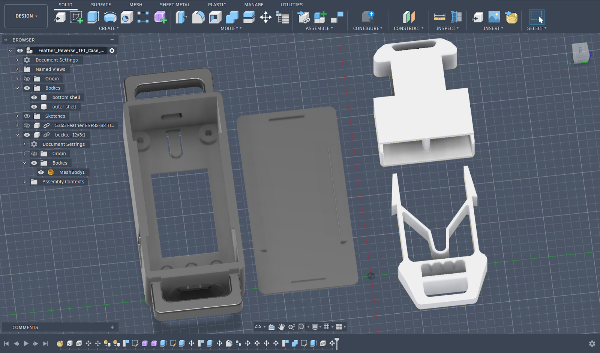
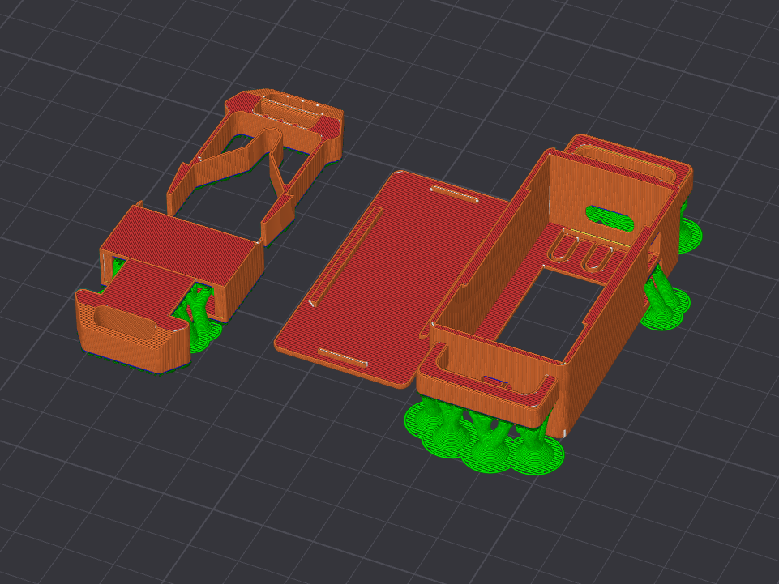
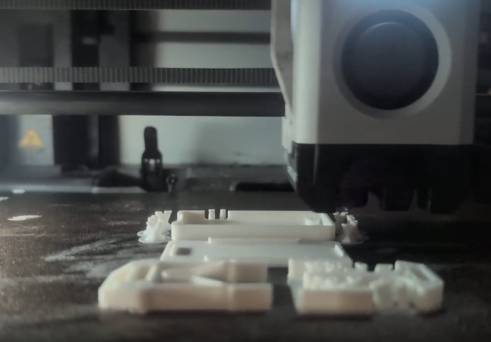
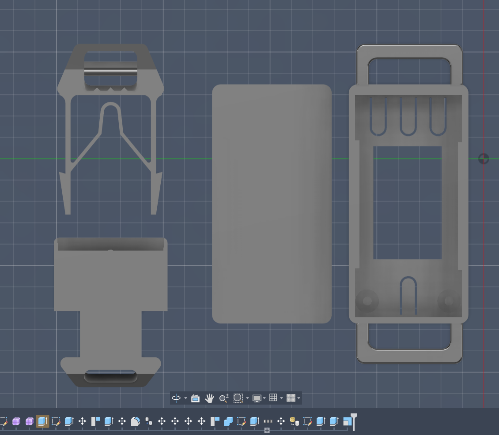
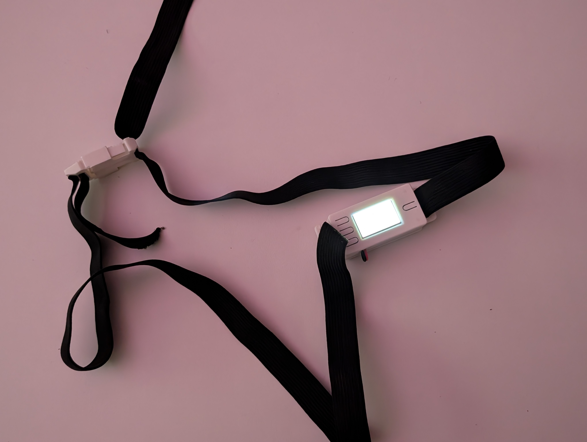
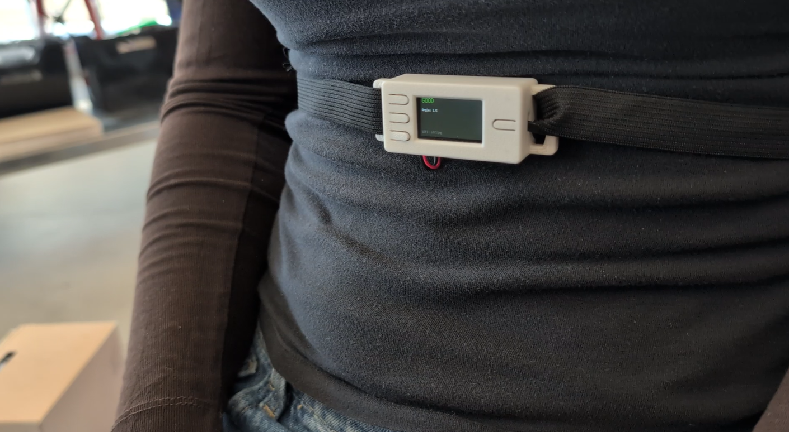
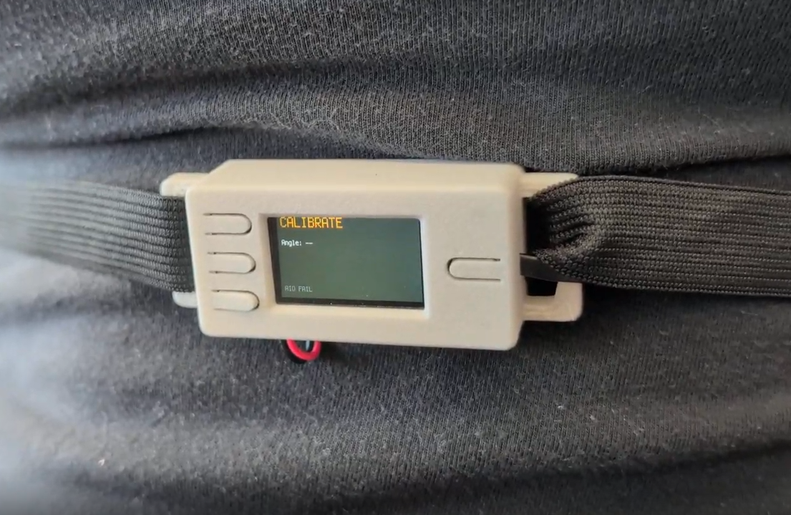
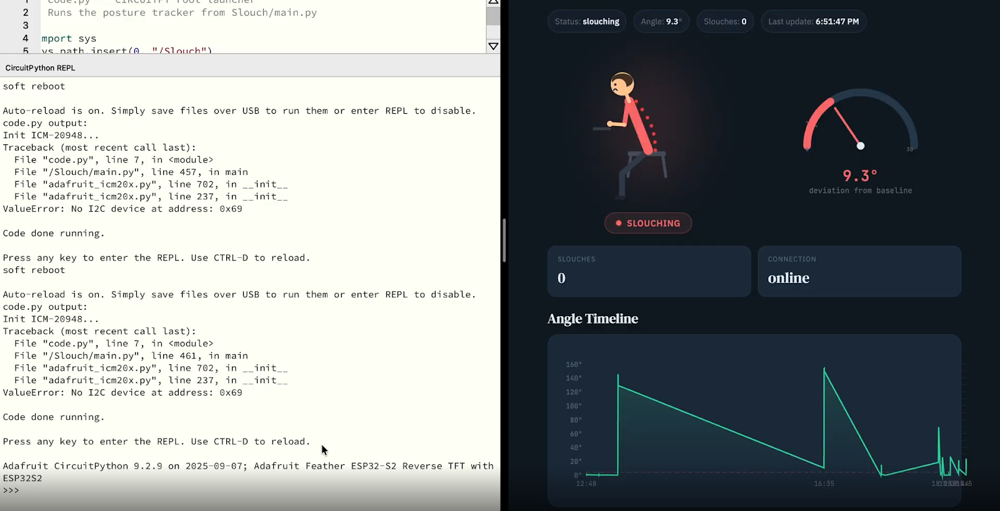

# Slouch Machine: A Wearable Posture Tracker

### Feather ESP32-S2 Reverse TFT • ICM-20948 IMU • Adafruit IO • Netlify

#### Ubiquitous Computing - Spring 2026  
**Nophar Shalom · Arya Prasad · Britney Ngaw**

---

A wearable posture-tracking system built using the **Adafruit Feather ESP32-S2 Reverse TFT** and an **ICM-20948 IMU** sensor.

The device measures body orientation and publishes posture data to **Adafruit IO** in real time. A hosted dashboard retrieves this data through a **Netlify Function proxy**, ensuring the Adafruit IO API key remains secure and is never exposed in the browser.

---

## Architecture

**Feather (CircuitPython) → Adafruit IO Feeds → Netlify Function Proxy → Dashboard (HTML/JS)**

Feeds (keys must match exactly):
- `posture-angle` (number)
- `posture-status` (`good` / `slouch_pending` / `slouching`)
- `slouch-count` (integer)

---

## Hardware

- Adafruit Feather ESP32-S2 Reverse TFT
- ICM-20948 IMU (STEMMA QT / I2C)

---

## Adafruit IO setup (feeds + key)

1. Create an Adafruit IO account.
2. Create these feed **keys**:
   - `posture-angle`
   - `posture-status`
   - `slouch-count`
3. Go to **Adafruit IO → My Key** and copy the **Active Key**.
   - If you click **Regenerate Key**, the key changes and **all old keys stop working immediately** (401 errors until updated everywhere).

---

## Feather setup (CircuitPython)

1. Install CircuitPython on the Feather.
2. Copy project files to the CIRCUITPY drive:
   - `code.py` at root
   - `Slouch/main.py` inside `Slouch/`
3. Install libraries into `CIRCUITPY/lib/` (minimum):
   - `adafruit_requests.mpy`
   - `adafruit_icm20x.mpy` (+ dependencies from the matching CP bundle)

### `settings.toml` (DO NOT COMMIT)

Create `settings.toml` **on the CIRCUITPY drive only**:

```toml
CIRCUITPY_WIFI_SSID="YOUR_WIFI_SSID"
CIRCUITPY_WIFI_PASSWORD="YOUR_WIFI_PASSWORD"

ADAFRUIT_IO_USERNAME="YOUR_AIO_USERNAME"
ADAFRUIT_IO_KEY="aio_XXXXXXXXXXXXXXXXXXXXXXXX"
```

Add `settings.toml` to `.gitignore` so it never gets pushed.

---

## Website deployment (Netlify)

### Why Netlify (instead of GitHub Pages)

Calling Adafruit IO directly from a static page forces you to put the key in the browser (bad) and can run into browser/CORS issues.
Netlify keeps the key server-side using environment variables + a proxy function.

### Files used

- `index.html` — dashboard UI
- `netlify/functions/aio.js` — proxy function to Adafruit IO
- `netlify.toml` — Netlify config

### Deploy steps

1. In Netlify: **Add new site → Import from Git** and select this repo.
2. In Netlify **Site settings → Environment variables**, add:
   - `AIO_USER` = your Adafruit IO username (e.g., `Bear2026_`)
   - `AIO_KEY` = your Adafruit IO key (`aio_...`)
3. Deploy. Your site will be at: `https://<your-site>.netlify.app`

### Test the proxy

Open:

```
https://<your-site>.netlify.app/.netlify/functions/aio?path=/feeds/posture-angle/data/last
```

You should see JSON. If you get **401**, your env vars are wrong or the key was regenerated.

---

## Real-time tuning (rates + thresholds)

### Why "too real-time" can break

If you publish too fast, Adafruit IO may return **429 rate limit** and the dashboard appears "stuck" (feeds stop updating).

Recommended approach:

- Publish every ~2 seconds
- Only send angle when it changes enough (e.g., ≥ 0.2°)
- Only send status/count when they change

Key knobs in `main.py`:

- `SAMPLE_INTERVAL` (sensor sampling)
- `EMA_ALPHA` (smoothing; higher = more responsive)
- `SLOUCH_ENTER_THRESHOLD` / `SLOUCH_EXIT_THRESHOLD`
- `SLOUCH_TIME_REQUIRED`
- `AIO_PUSH_INTERVAL` (+ angle delta threshold)

---

## Storage note (why more sensitivity uses more space)

In simple terms: **more sensitive = more tiny movements detected = more updates recorded/sent.**
More updates means more data points, so:

- CSV/history logs fill faster (if logging is enabled), and/or
- Adafruit IO receives more messages (can hit rate limits)

### Ideal product direction

A production version would:

- Stream efficiently (MQTT/WebSockets) instead of frequent polling
- Downsample/aggregate (store averages; keep raw briefly)
- Use a proper backend/time-series store (not a growing CSV)
- Buffer locally and upload in batches

---

## Media

- Screenshot (Adafruit IO dashboard): 

- Recording of how posture tracker: https://drive.google.com/drive/u/1/folders/15TgOk4-ZYy6qjLrsFPw8F6O9h75ClWop
  
- Adafruit_feather and sensor: https://drive.google.com/drive/u/1/folders/15TgOk4-ZYy6qjLrsFPw8F6O9h75ClWop

---

## Troubleshooting

- **401 Unauthorized (Feather or site):** wrong username/key OR key was regenerated.
- **429 rate limit:** increase publish interval and/or only send on change.
- **Dashboard not updating:** confirm Adafruit IO feed timestamps change; then test the Netlify proxy endpoint.
- **Captive portal Wi-Fi:** may "connect" but block requests—use a hotspot for testing.

---

# Visual Process

<p align="center">
  
</p>

This project combines embedded systems, wearable ergonomics, and rapid fabrication. The enclosure evolved through multiple iterations to balance comfort, sensor stability, manufacturability, and long-duration wearability.

## 3D CAD Design

<p align="center">
  
</p>

CAD enclosure modeling showing component placement and wearable orientation.

The enclosure was designed to house the Feather ESP32-S2 Reverse TFT, IMU wiring, and LiPo battery while remaining lightweight enough for wearable use.

Design goals

- Stable IMU orientation relative to the user’s back
- USB charging and reset accessibility
- STEMMA QT cable strain relief
- Comfortable wearable profile

## Reference Designs and Modifications

We used existing open-source Feather-compatible enclosures and wearable housings to understand tolerances, mounting geometry and dimensions, as well as fabrication constraints.

Key modifications:

- Adjusted internal geometry for Reverse TFT depth with LiPo battery
- Redesigned sides to include strap placement
- Improved USB port clearance & added additional ports for wire clearance and battery connection

References:

- Original enclosure reference: [(Reverse TFT Feather Case)](https://www.thingiverse.com/thing:5973529)
- Wearable clip inspiration: [(Customizable Buckle)](https://www.thingiverse.com/thing:5101115/makes)


## 3D Slicing and Printing

<p align="center">
  
</p>

Slicer preparation showing print orientation and support generation.

Print considerations

- Layer orientation optimized for clip strength
- Reduced support material
- Increased wall thickness near mounting areas

Typical settings:

- General PLA
- 0.2 mm layer height
- 15–20% infill
- Supports

3D printing and enclosure fabrication (click image to see video):

<p align="center">
  <a href="https://drive.google.com/file/d/1FbvyDCKWXbVOypSRtEGqt7djg1WBOWOk/view?usp=sharing">
    
  </a>
</p>

## Fabrication and Assembly

<p align="center">
  
  
</p>

Completed enclosure print followed by early hardware assembly prototype.

Printed enclosures were post-processed and assembled with embedded electronics.


Assembly process:

1. Install Feather board in case.

2. Secure LiPo battery with outer wiring.

3. Route I2C wiring to the IMU.

4. Adjust strap to fit user properly for calibration.

Wiring was placed and secured along a flexible band to improve fit during wear.

### Initial Assembly

Early enclosure assembly and electronics integration: (click image to see video)

<p align="center">
  <a href="
https://drive.google.com/file/d/1crDYZxgLLTvSVz81fS-dJUKGRQsMUaWY/view?usp=sharing">
    
  </a>
</p>

## Final Product

<p align="center">
  
</p>

Wearability and posture testing during real-world usage scenarios.

The final wearable integrates hardware, firmware, and cloud visualization into a cohesive posture monitoring system.

Features:

- Real-time posture detection

- On-device TFT feedback

- Cloud logging through Adafruit IO

- Secure dashboard visualization via Netlify proxy

### Final Device

Full demonstration:

Sensor calibration and posture detection testing during real-world use. (click image to see video)

<p align="center">
  <a href="https://drive.google.com/file/d/1eB8yDOSDPG94FNZO_nUaPzLeyFMZ-4ct/view?usp=sharing">
    
  </a>
</p>

Posture angle detection in real time. (click image to see video)

<p align="center">
  <a href="https://drive.google.com/file/d/1AbkzzD-HoGZfyIwDuEWccdJo2HRMx0Ap/view?usp=sharing">
    
  </a>
</p>

Live posture monitoring dashboard connected through Adafruit IO and Netlify proxy. (click image to see video)

<p align="center">
  <a href="https://drive.google.com/file/d/1KjgYxJG_VfTvVZ90FUxOWDMmCyMOeKok/view?usp=sharing">
    
  </a>
</p>

## Reflection

We approached this project as an exploration of how wearable design, rapid fabrication, and behavioral feedback systems can come together to support everyday habits. Collaboration played a major role throughout the process. By sharing responsibilities across hardware development, fabrication, and interface design, we were able to continuously give feedback, challenge ideas, and improve each iteration together. As we moved through multiple physical prototypes, we quickly learned how small ergonomic adjustments could make a big difference in usability and long-term comfort, especially when informed by group testing and discussion.

Calibration testing also highlighted how personal posture really is. Each of us sat and moved differently, and comparing those differences helped us understand how adaptable the system needed to be, which shows the importance of creating an accessible and adjustable device. Building both the hardware and the web interface in parallel reinforced the importance of thinking about the system holistically rather than separating interaction design, fabrication, and software into isolated stages. Rapid 3D printing allowed us to experiment quickly, while collaborative user testing showed how subtle feedback can encourage behavioral change without feeling distracting or intrusive.

In future iterations, we would focus on further miniaturization, stronger enclosure materials, and clearer long-term data visualization. Additionally, adding more sensors, such as integrated buzzers, could create a more interactive system that clearly shows system status through  multiple outlets. Continuing to build on the teamwork and iterative workflow we developed during this project would help us create a more refined device that better supports everyday posture awareness.
